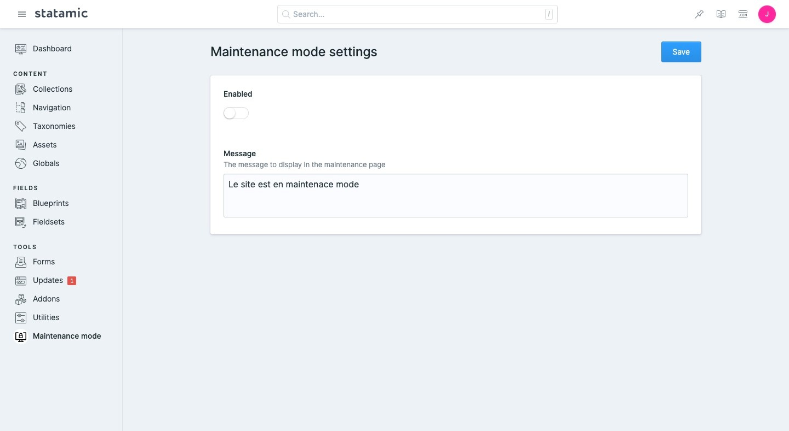

<!-- statamic:hide -->


# Statamic Maintenance mode

<!-- /statamic:hide -->

A tiny addon for Statamic to set the website in maintenance mode and block all non-logged in users from accessing it.

NB: If you want to have full control and set your own protection flow, please see [Protecting content](https://statamic.dev/protecting-content).

# Installation

You can install the package via composer:

```bash
composer require plugrbase/statamic-maintenance-mode
```

Publish the config file of this package:

```bash
php artisan vendor:publish --provider="Plugrbase\MaintenanceMode\ServiceProvider"
```

# Control Panel

Once installed, you can access the settings in the control panel by clicking the "Maintenance Mode" button.



## Official Support

If you're in need of some help, drop an email to [hello@plugrbase.com](mailto:hello@plugrbase.com)!

# License

The MIT License (MIT). Please see [License File](LICENSE.md) for more information.
